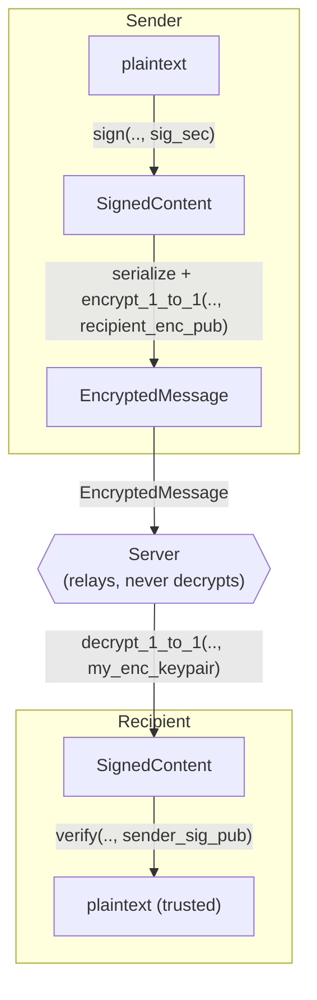

# bilattice

Hybrid post-quantum cryptographic primitives for a 1-to-1 secure messaging app.
Every operation runs a classical **and** a post-quantum algorithm side by side,
so a break in one still leaves the other standing.

- `bi` — two algorithms per operation (classical + post-quantum).
- `lattice` — ML-KEM / ML-DSA are lattice-based.

| Operation     | Classical | Post-quantum | Combiner / AEAD     |
|---------------|-----------|--------------|---------------------|
| KEM / encrypt | X25519    | ML-KEM-768   | HKDF-SHA3-256 → ChaCha20-Poly1305 |
| Signature     | Ed25519   | ML-DSA-65    | both must verify (AND) |

> This crate is a standalone primitive layer. It is **not** `facet-core`, and it
> is not tied to Facet — it could back any messaging app. The optional `mls`
> feature adds the first OpenMLS group-transport helpers; federation still lives
> above this crate.

## Scope

bilattice gives you four building blocks and nothing more:

| Function | Purpose |
|----------|---------|
| `generate_keypair()`   | mint one identity (encryption keypair + signing keypair) |
| `encrypt_1_to_1()`     | seal a message for one recipient |
| `decrypt_1_to_1()`     | open a sealed message |
| `sign()` / `verify()`  | prove / check who authored a blob |
| `mls` feature          | wrap `SignedContent` in OpenMLS application messages |

It deliberately does **not** provide:

- **Sessions or ratcheting.** Each `encrypt_1_to_1` is an independent sealed
  envelope (fresh ephemeral X25519 key + fresh ML-KEM encapsulation per
  message). Group session state is delegated to OpenMLS behind the optional
  `mls` feature.
- **Automatic sender authentication.** Encryption and signing are separate
  operations on separate keys. Encrypting does not sign. See
  [Putting it together](#putting-it-together).
- **Delivery Service or federation.** The server still only stores and relays
  opaque bytes. Group membership policy, queues, federation and durable MLS
  state belong above this primitive crate.

## Integration in a messaging app

### 1. Registration — one identity per device

```rust
use bilattice::generate_keypair;

let (encryption, signing) = generate_keypair()?;

// publish the PUBLIC halves to your identity/key server:
let enc_pub = &encryption.kp_pub; // EncryptionKeypairPublic
let sig_pub = &signing.kp_pub;    // SignKeypairPublic

// keep the secret halves on the device only.
```

The two keypairs are independent (different algorithms, different keys) but
belong to the same logical identity, so they're generated together. Everything
is `serde`-serializable, so the public keys go straight onto the wire and the
secret keys into your platform keystore.

### 2. Sending a message — sign then encrypt

`encrypt_1_to_1` gives confidentiality and tamper-detection, but **anyone** with
the recipient's public key can produce a valid envelope — it does not prove who
sent it. To authenticate the sender, sign the plaintext first and encrypt the
signed blob (**sign-then-encrypt**), so the signature stays hidden from the
transport server:

```rust
use bilattice::{sign, encrypt_1_to_1};

let signed = sign(plaintext, &signing.kp_sec)?; // SignedContent
let bytes  = serialize(&signed);                // any serde codec
let envelope = encrypt_1_to_1(bytes, &recipient_enc_pub)?; // EncryptedMessage

// hand `envelope` to the (untrusted) server to relay — it sees neither
// the plaintext nor who signed it.
```

### 3. Receiving a message — decrypt then verify

```rust
use bilattice::{decrypt_1_to_1, verify};

let bytes  = decrypt_1_to_1(envelope, &my_encryption_keypair)?;
let signed = deserialize(&bytes);               // SignedContent

match verify(&signed, &sender_sig_pub) {
    Ok(())      => { let plaintext = signed.content; /* trust it */ }
    Err(layers) => {
        // layers.dilithium / layers.ed25519 tell you which check failed
    }
}
```

`verify` requires **both** signatures to pass; a failure reports per-algorithm
detail via `LayerErrors`.

### 4. Group messages — sign then MLS encrypt

With `--features mls`, group transport uses OpenMLS with the libcrux provider
and the X-Wing ciphersuite `MLS_256_XWING_CHACHA20POLY1305_SHA256_Ed25519`
(`0x004D`). Application messages remain bilattice payloads:

```rust,no_run
use bilattice::mls;

let outbound = mls::create_signed_application_message(
    &mut group,
    &provider,
    &signing.kp_sec, // MLS Ed25519 protocol signature
    &signing.kp_sec, // bilattice Ed25519 + ML-DSA content signature
    plaintext,
)?;

let bytes = mls::serialize_message(&outbound)?;
// relay `bytes` through the Delivery Service unchanged.
```

On receive, `mls::process_signed_application_message` decrypts via MLS,
deserializes `SignedContent` with `postcard`, and then calls `verify`, so both
Ed25519 and ML-DSA-65 must pass before the plaintext is trusted.

### Putting it together



## Wire format & versioning

`EncryptedMessage` is self-contained: it carries the ephemeral X25519 public
key, the ML-KEM ciphertext, the sealed payload, and a `version` byte. The AEAD
nonce is **derived** (from a transcript hash binding the ephemeral key, the
recipient's keys and the ML-KEM ciphertext), not random — so it isn't a public
field, and `decrypt_1_to_1` re-derives it.

`decrypt_1_to_1` rejects any message whose `version` ≠ `ENCRYPTED_MESSAGE_VERSION`
(currently `2`), so the format can evolve without old and new clients silently
misreading each other.

## Design notes

### KEM combiner — inspired by X-Wing, not conformant

bilattice uses the same algorithm pair as
[X-Wing](https://doi.org/10.62056/a3qj89n4e) (Barbosa et al., IACR CiC 2024;
IETF draft `draft-connolly-cfrg-xwing-kem`) — ML-KEM-768 + X25519 — and borrows
its idea of folding contextual material into the key derivation. It is **not** an
X-Wing implementation and does not aim for interoperability with one; the
combiner construction is bilattice's own. Treat the parallels as inspiration, not
a compatibility guarantee.

What the code actually does:

1. **Two shared secrets, concatenated as IKM.** X25519 ECDH (ephemeral x
   recipient) gives 32 bytes; ML-KEM-768 decapsulation gives 32 bytes; they are
   concatenated into a 64-byte input keying material (`ss_x25519 || ss_ml-kem`).
2. **A SHA3-256 transcript hash binds the context.** A separate SHA3-256 digest
   covers a domain-separation string, an algorithm-suite string, the ephemeral
   X25519 public key, the recipient's X25519 and ML-KEM public keys, and the
   ML-KEM ciphertext.
3. **HKDF-SHA3-256 derives the AEAD key + nonce.** Extract-and-expand with a
   fixed salt (`HKDF_SALT = "Facet's bilattice v1 lib"`), the 64-byte IKM as
   input, and an `info` parameter built by concatenating
   `AEAD_INFO_LABEL = "chacha20poly1305 key"`, a NUL byte, the 32-byte transcript
   hash, another NUL byte, and the direction tag
   `MESSAGE_DIRECTION = "1to1 message sender->recipient"`. The 44-byte output is
   split into a 32-byte ChaCha20-Poly1305 key and a 12-byte nonce.

**How this differs from X-Wing.** X-Wing combines everything in a single bare
SHA3-256 call, with the ciphertext and recipient public key sitting *next to* the
shared secrets in the hash input. bilattice instead (a) uses HKDF
(extract-then-expand) rather than a raw hash, (b) keeps the IKM to just the two
shared secrets, and (c) routes all the binding material (ephemeral key, recipient
keys, ML-KEM ciphertext) through the transcript hash into HKDF's `info`. Including
the ML-KEM ciphertext in the binding is a deliberately conservative choice; the
FO transform in ML-KEM means X-Wing can justify omitting it. None of this has
been independently reviewed — it is a learning-project construction, so prefer a
vetted combiner if you reuse this crate for anything real.

### Signatures

Hybrid: ML-DSA-65 (NIST FIPS 204) + Ed25519, signed in parallel. `verify`
requires **both** to pass (AND, not OR), and the Ed25519 side uses
`verify_strict` to reject malleable / non-canonical signatures. Content
signatures are domain-separated: Ed25519 signs a bilattice-prefixed message, and
ML-DSA-65 uses a non-empty FIPS 204 context string. A signature produced by
`sign` is therefore not a valid signature over the raw content bytes in another
protocol.

This layer deliberately produces transferable authorship proofs. That is useful
for some app designs, but it is not Signal-style deniability: a receiver can
show a valid `SignedContent` to someone else. To prevent surreptitious
forwarding, the application payload passed to `sign` should include the intended
recipient, conversation, or transcript context when that distinction matters.

### MLS group transport

The optional `mls` feature fixes Facet's group transport to OpenMLS + libcrux
with X-Wing `0x004D`: ML-KEM-768 + X25519 for HPKE, ChaCha20-Poly1305 for AEAD,
HKDF-SHA256, and Ed25519 for the mandatory MLS protocol signatures. `0x004D` is
still a draft ciphersuite code point, so a future OpenMLS/IETF update could
require a wire-format migration. bilattice's hybrid `SignedContent` sits inside
the encrypted MLS application message. MLS membership operations themselves are
authenticated by Ed25519 because current OpenMLS ciphersuites do not provide a
standard hybrid signature scheme.

The ratchet tree extension is enabled in the default group config so Welcome
messages are self-contained for the client. The Delivery Service still does not
decrypt or inspect them.

## Status

| Function          | State |
|-------------------|-------|
| `generate_keypair`| V |
| `encrypt_1_to_1`  | V |
| `decrypt_1_to_1`  | V |
| `sign`            | V |
| `verify`          | V |
| MLS group transport | V initial helper API behind `--features mls` |

Run `cargo doc -p bilattice --open` for the full API reference, or
`cargo test -p bilattice` for primitive tests. Run
`cargo test -p bilattice --features mls` for the OpenMLS round-trip test.
